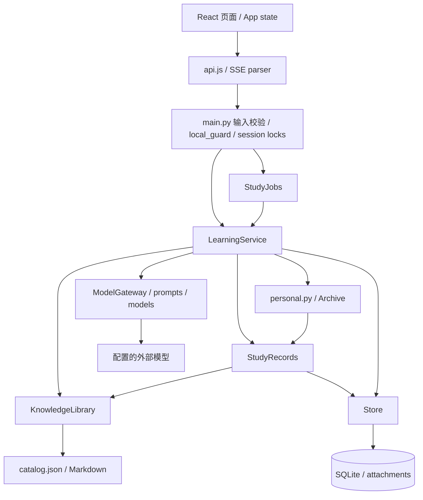

# 当前架构与工程边界

核验基线：2026-09-18；这是现有代码说明，不是未来系统蓝图。历史需求/设计在 `docs/superpowers/`；日常开发以本文件、当前代码及明确需求为准。

## 技术栈与目录

| 层 | 真实实现 |
| --- | --- |
| 前端 | React 19.2.8，JavaScript/JSX，Vite 8.2.2；已安装 TypeScript 7.0.2，用于渐进 checkJs，未迁移 TS |
| UI | 手写全局 CSS + 档案局部 CSS；Lucide 图标；react-markdown、GFM、remark-math、KaTeX |
| API | FastAPI 0.128.8、Pydantic 2.13.5、Uvicorn 0.39.0；工厂 `app.main:create_app` |
| 模型 | httpx，OpenAI-compatible Chat Completions；vision/solve/chat 三个任务 |
| 持久化 | Python sqlite3，WAL；大量领域数据放在 JSON TEXT 内；图片独立文件 |
| 测试 | pytest + FastAPI TestClient/httpx mock；Vitest 的纯函数、API mock、SSR 断言；Playwright 真实浏览器 |

```text
app/          API、学习编排、模型、知识、个人记录、SQLite
web/src/      App、Study、Knowledge、Reviews、Archive、Settings、ui、api、domain
knowledge/    catalog.json + nodes/*.md；维护者管理的公共知识
tests/        后端测试及隔离浏览器服务 fixture
web/e2e/      浏览器交互测试
scripts/      统一检查入口
docs/         当前工程文档及历史设计
data/         忽略提交：learning.sqlite3、attachments/；仅真实本地数据
web/dist/     忽略提交：构建产物，FastAPI 静态托管
```

## 模块职责和依赖方向



- `main.py`：路由、严格输入模型、脱敏返回、锁、本机访问中间件、上传、静态资源。不直接实现模型判分算法。
- `service.py`：识别/解题/讲解编排，question revision、可用解答判定、原题重答、撤销、检索审计与公开 session 投影。
- `jobs.py`：进程内后台 OCR/solve 队列；共享求解槽位，首题优先、最多 3 题一批；主动交互暂停启动新后台调用。不是分布式任务队列。
- `providers.py`：模型配置、HTTP、结构化校验、有限重试、流输出和安全遥测；`prompts.py` 过滤模型输入，`models.py` 定义响应及选项校验。
- `knowledge.py`：只读知识目录校验、文本检索和 context；不写个人数据库。
- `study.py`：稳定知识 ID 挂载、事实事件、状态摘要、原题复习和推荐投影。
- `classification.py`：题目考法/条件/难度的受控元数据与保守分组键，不诊断学生错因。
- `personal.py`：个人可见知识投影、至多两道相关历史；`archive.py`：档案偏好和由有效证据计算的藏章。
- `store.py`：连接、建表、session JSON、配置密钥、删除和中断恢复。当前有 `store → providers.normalize_error_kind → models/classification` 的既有依赖，不在本次搬动。

新增依赖应沿上述方向：前端经 `api.js` 调 API，不访问数据库/知识源文件；领域服务不导入 HTTP 路由；知识模块不导入个人服务；模型输出不直接写数据库/知识文件。禁止引入循环。当前 HTTP 对 Store 的直接调用和 Store 的错误归一化依赖是已存在的边界，不代表要扩展成任意互调。

## 前端和状态管理

`main.jsx` 挂载 App。没有 React Router、Redux、Zustand 或 query cache；页面由 `App.jsx` 的 `page` state 切换，不是服务端路由。`personal.py` 的 source_url 只是引用字符串，不能假定 `/sessions/...` 是可直接打开的 SPA 深链。

App 持有当前 session、列表、wiki、reviews、archive、settings、selected、busy/error；`run` 串行化用户操作并 refresh。`sessionEpoch` 拒绝过期轮询，`mergePolledSession` 保留流式临时消息。只轮询当前后台 session，最终持久化数据以服务端为准。各页面保留表单、过滤器、当前 review 等局部 state；聊天高度以 localStorage 保存。没有离线答题同步。

`Study.jsx` 同时包含 Dashboard、题目/选项、编辑、聊天等较多职责；保留文件组织以控制 diff。`ui.jsx` 提供 Markdown、Modal、Empty、Sources、Loading、dateText。`domain.js` 放纯函数，`api.js` 统一 JSON fetch、URL 编码、SSE 完成/失败判定；档案分享 SVG 在 `archive.js`。

## 核心领域对象

| 概念 | 对应代码/存储 | 不变量 |
| --- | --- | --- |
| Question | `ExtractedQuestion` → `sessions.data.questions[]`；id、revision、kind/text/options、原 user_answer、analysis、attempts 等 | 只支持 single/multiple/judge；题干修订增加 revision 并撤销旧判断；原答案不被重答替换 |
| Question–Knowledge Mapping | `question_links`；`StudyRecords.attach/match/links` | 多对多，稳定知识 ID；先验证所有 ID 再替换；手工解除/修正通过 links_managed 保留权威 |
| Knowledge Graph | `knowledge/catalog.json` 的 chapters/nodes/relations；Markdown 内容 | prerequisite/related/contrast；无图数据库/嵌入索引；目标存在且非自身；没有通用 DAG/环检测保证 |
| Solution / analysis | `models.Solution`；question.analysis | schema_version=3、confirmed/pending、answer/explanation/correct/citations；correct=None 表示无有效判分；模型确认不等于学科事实正确 |
| Attempt | 原照片答案；question.attempts[]；`study_events` 的 observed_answer/answer/review_answer | 没有统一 Attempt 表/类。站内重答细节在 session，复习答案在 review_runs；事件主要存判定与帮助事实 |
| Learner State | `StudyRecords.summary/learning` 的实时投影 | 没有 learner_state 表或掌握率模型；只统计 valid=1 的可观察事件，不把多知识点题的错答推断为各节点未掌握 |
| Review / Recommendation | `review_runs` + `StudyRecords.queue/start/review` + `classification.group_key` | 复习针对具体原题与 revision；代表题结果不会传播到同组题；推荐预算 3/5/10，不改积压题日期 |
| Archive / Medals | `archive_profile` 偏好 + `Archive.medals` 投影 | 获得条件由有效事实、revision、知识版本重新核验，主题不改变资格 |

`event.help_kind` 区分 unknown / independent / assisted。保存题目、查看解析不是答对。知识检索命中不是正确性的证明。旧 evidence/旧 diagnosis 保留兼容但不进入新 learner state。

## 主要数据流

1. **获取题目**：上传 → 验证文件头/大小 → attachments → vision（可流式 NDJSON）→ Pydantic → 保存 Question → match 到稳定知识 ID。没有预置题库，question retrieval 是从自己的 session/关联题目/历史队列取题；knowledge retrieval 是标签/双字片段/已发布正文的文本匹配。
2. **解题**：prepare_question → wiki_context（最多 5 节点，每段最多 12000 字符）→ prompt 去除个人答案/思路 → solve → 选择题答案校验与完整性检查 → analysis → source event → 保存 session。缺失/低置信度分类不破坏有效解答。
3. **提交答案**：retry 路由 → 选项合法性校验 → normalized_answer 比较 → answer event + question.attempts → 标记已获帮助/已揭示 → 保存。照片首次答案保留。
4. **状态/推荐**：有效 study_events + question_links → summary/learning；confirmed schema v3 题的最近 next_due_at → queue → 保守分组、去重、跨知识点轮选代表题。元数据缺失、低置信度或挂载范围冲突时独立保留。
5. **复习**：start 返回无答案 question 快照，绑定 revision；review 在 BEGIN IMMEDIATE 内验证状态、判分并同时提交 run 与 event；重复提交拒绝。提示/解析/其他面板查看会污染同题 ready runs 的帮助标记。
6. **调度**：初次 1 天；独立成功按上海日期计数使用 1/3/7/14/30 天并封顶；当天不重复延长；错答或辅助作答当次回到 1 天。实现中错答重置独立成功统计窗口，辅助作答不删除过去成功事件；不要在无需求时把二者改成完全相同的状态机。
7. **修订/复核**：invalidate 撤销有效事件和 legacy evidence，revision +1，删除旧 analysis/分类/检索审计；保留 help_seen 和数据库历史。旧 run 在访问时因 revision 不符失效。
8. **讲解**：仅已揭示且非提示模式加入最多两题历史；对话按 question_id + revision 隔离，最近 12 条；知识/历史版本或引用消息失效时过滤旧上下文。中断文本不存为完整助手回答，已显示内容仍记为获得帮助。

**公开 session 的边界不是“隐藏标准答案的考试 API”**：`public_session` 移除候选节点、内部审计、旧诊断等，但目前普通 session 响应仍带 analysis.answer/explanation，前端只默认折叠显示。Review start/hint 有更严格的无答案投影；不能把 UI 折叠宣称为服务端保密。

## 数据库实际 schema

默认 `data/learning.sqlite3`，可用 GRID_LEARNING_DATA 改目录；每次 connect 设置 WAL，timeout=20s。无 ORM，无数据库 migration runner。

| 表 | 列 / 约束 | 创建位置 |
| --- | --- | --- |
| sessions | id TEXT PK, data TEXT NOT NULL | Store |
| evidence | id PK, session_id, question_id, knowledge_id, valid NOT NULL, data NOT NULL；source 索引 | Store，遗留数据 |
| config | id INTEGER PK, data NOT NULL | Store；id=1，含明文模型密钥 |
| calls | id PK, data NOT NULL | Store；白名单遥测字段 |
| daily_sessions | day PK, sequence INTEGER NOT NULL | Store；北京时间单日名称序号 |
| question_links | user_id/session_id/question_id/knowledge_id 复合 PK，source | StudyRecords |
| study_events | id PK, user_id, session_id, question_id, valid NOT NULL DEFAULT 1, data NOT NULL；来源索引 | StudyRecords |
| review_runs | id PK, user_id, data NOT NULL | StudyRecords |
| archive_profile | user_id PK, data NOT NULL | Archive |

`LOCAL_USER='local'` 只是固定键。没有 FK、JSON CHECK、租户约束；SQLite rowid 表的 TEXT/复合 PK 不等同于显式 NOT NULL。知识外键由应用校验。当前“建表”仅 CREATE IF NOT EXISTS，不能升级既有列。analysis.schema_version 仅解答版本，不是数据库版本。

删除 session 总会删 links、review_runs、原图；delete_evidence=true 再删 events/evidence；false 保留历史事实，但投影通过现存 session 不再使用。普通作答、挂载、event 与 session 保存分多个事务，有故障中途不一致风险；复习的 run+answer event 已在单事务内。

## Protected Core 与高风险变更

完整列表及强制 review 规则见根目录 `AGENTS.md`。下列变化应先设计：判分/归一化与题型、revision/撤销、知识 ID/发布规则、帮助暴露/时间语义、推荐分组、跨会话并发、SSE 结束语义、数据格式/迁移、任何认证/授权/支付。

不要把工作流分拆、多 worker 或数据库替换当作普通配置修改：session 锁、organizing、jobs、限流预算都在单进程内存。多 Uvicorn workers 会绕开这些协调机制，启动恢复也会误判其他进程任务。

## 构建与部署现状

`npm --prefix web run build` → web/dist；FastAPI 挂载 /assets 并在 / 返回 index；/api/docs 和 /api/openapi.json 提供接口文档。开发 Vite 5173 代理 API 到 8765。macOS start.command 只在虚拟环境/构建目录缺失时安装/构建，**已有 dist 不会自动重建**。

当前单机单用户、单进程、绑定 loopback。Host/Origin/sec-fetch-site 检查抵御部分本机网页攻击，不能代替认证。没有 Docker、远程部署、账户、订阅或支付实现。商业上线前的阻断项和备份/revert 流程见 `DEVELOPMENT.md`；此次不开放公网，不修改这些业务/安全边界。
